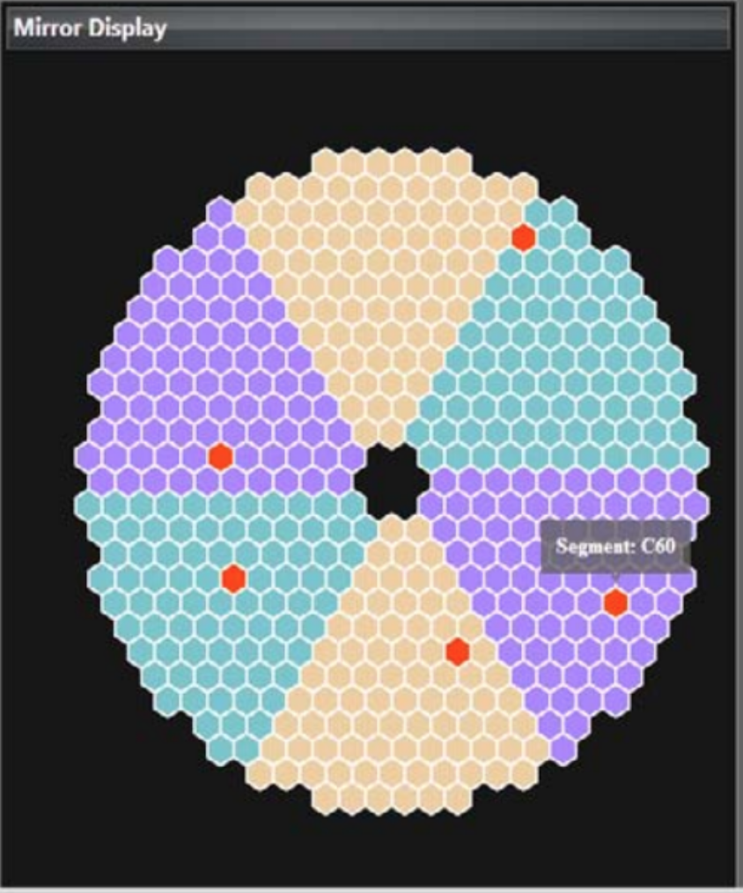
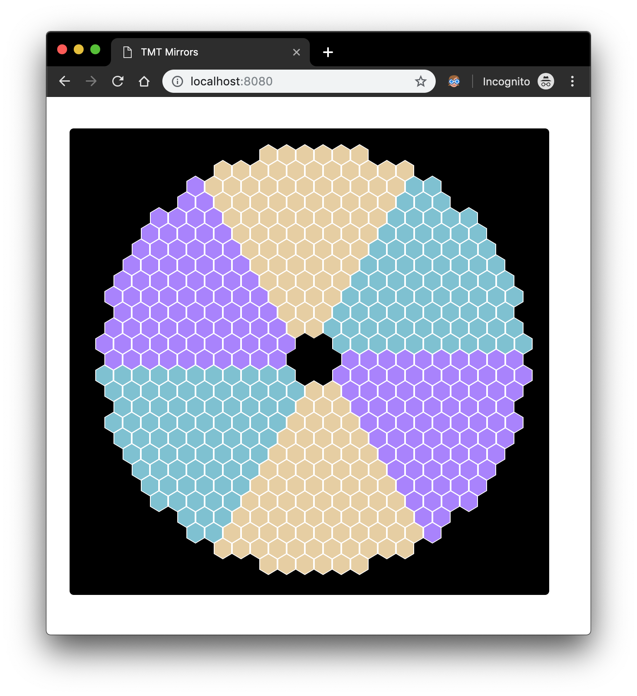

# TMT Mirror Visualisation UI Spike

This project uses [scala-js](https://www.scala-js.org/) with [react4s](http://www.react4s.org/) and
is inspired from "Concept Document on Diagnostic Visualization Tool".

Here's how the concept mirror visualisation looks like in the document:



This spike solves only the layout problem and is NOT able to identify every segment with a unique ID. (yet)



----

I created a small DSL to define segment data in an easy way. Here's how all the segments are defined

```scala
  val segments: Seq[SegmentRow] = Seq(
    A * 6,
    A * 11,
    F + (A * 11) + (B * 2),
    (F * 2) + (A * 10) + (B * 3),
    (F * 4) + (A * 9) + (B * 5),
    (F * 5) + (A * 8) + (B * 6),
    (F * 6) + (A * 7) + (B * 7),
    (F * 7) + (A * 6) + (B * 8),
    (F * 8) + (A * 5) + (B * 9),
    (F * 9) + (A * 4) + (B * 10),
    (F * 9) + (A * 3) + (B * 10),
    (F * 10) + (A * 2) + (B * 11),
    (F * 11) + (Empty * 2) + (B * 11),
    (F * 10) + (Empty * 3) + (C * 10),
    (E * 11) + (Empty * 2) + (C * 11),
    (E * 11) + (D * 2) + (C * 10),
    (E * 10) + (D * 3) + (C * 9),
    (E * 10) + (D * 4) + (C * 9),
    (E * 9) + (D * 5) + (C * 8),
    (E * 8) + (D * 6) + (C * 7),
    (E * 7) + (D * 7) + (C * 6),
    (E * 6) + (D * 8) + (C * 5),
    (E * 5) + (D * 9) + (C * 4),
    (E * 3) + (D * 10) + (C * 2),
    (E * 2) + (D * 11) + (C * 1),
    D * 11,
    D * 6
  )
```

Each item in this sequence represents a "row" of the mirror. Each Row has multiple "spans"; each span containing multiple 
segments that belong to same "sector".

Each segment is an svg image of hexagon shape. There are 3 different colors and their 3 different images. An appropriate 
image is rendered based on which sector it belongs to

```scala
case Sector.A | Sector.D => A.src("images/hexagon-a-d.svg")
case Sector.B | Sector.E => A.src("images/hexagon-b-e.svg")
case Sector.C | Sector.F => A.src("images/hexagon-c-f.svg")
```

